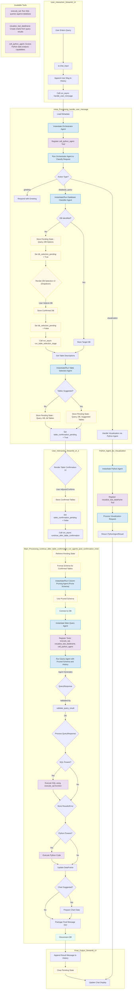

```mermaid
flowchart TD
 subgraph User_Interaction_Streamlit_UI["User_Interaction_Streamlit_UI"]
        B["st.chat_input"]
        A["User Enters Query"]
        C["Append User Msg to History"]
        D["Call run_async handle_user_message"]
  end
 subgraph Initial_Processing_handle_user_message["Initial_Processing_handle_user_message"]
        E["Load Metadata"]
        F1["Instantiate Orchestrator Agent"]
        F2["Register call_python_agent Tool"]
        F3["Run Orchestrator Agent to Classify Request"]
        F4{"Action Type?"}
        F5["Respond with Greeting"]
        F6["Handle Visualization via Python Agent"]
        F["Instantiate/Run Database Classifier Agent"]
        G{"DB Identified?"}
        H2["Store Pending State - Query, DB Options"]
        H3["Set db_selection_pending = True"]
        H4{"Render DB Selection UI (Dropdown)"}
        H5["Store Confirmed DB"]
        H6["Set db_selection_pending = False"]
        H7["Call run_async run_table_selection_stage"]
        I["Store Target DB"]
        J["Get Table Descriptions"]
        K["Instantiate/Run Table Selection Agent"]
        L{"Tables Suggested?"}
        M2["Store Pending State - Query, DB, All Tables"]
        N["Store Pending State - Query, DB, Suggested Tables"]
        O["Set table_confirmation_pending = True"]
  end
 subgraph User_Interaction_Streamlit_UI_2["User_Interaction_Streamlit_UI_2"]
        P{"Render Table Confirmation UI"}
        Q["Store Confirmed Tables"]
        R["Set table_confirmation_pending = False"]
        S["Call run_async continue_after_table_confirmation"]
  end
 subgraph Main_Processing_continue_after_table_confirmation_run_agents_post_confirmation_inner["Main_Processing_continue_after_table_confirmation_run_agents_post_confirmation_inner"]
        T["Retrieve Pending State"]
        U["Format Schema for Confirmed Tables"]
        U2["Instantiate/Run Column Pruning Agent (Prune Schema)"]
        U3["Use Pruned Schema"]
        V["Connect to DB"]
        W1["Instantiate Main Query Agent"]
        W2["Register Tools: execute_sql, visualize_last_dataframe, call_python_agent"]
        W3["Run Query Agent with Pruned Schema and History"]
        X{"QueryResponse"}
        X_Val["validate_query_result"]
        Y{"Process QueryResponse"}
        Z{"SQL Present?"}
        AA["Execute SQL using execute_sql function"]
        AB{"Store Results/Error"}
        AC{"Python Present?"}
        AD["Execute Python Code"]
        AE["Update DataFrame"]
        AF{"Chart Suggested?"}
        AG["Prepare Chart Data"]
        AH["Package Final Message Dict"]
        AI["Disconnect DB"]
  end
 subgraph Python_Agent_for_Visualization["Python_Agent_for_Visualization"]
        PY1["Instantiate Python Agent"] 
        PY2["Register visualize_last_dataframe Tool"]
        PY3["Process Visualization Request"]
        PY4["Return PythonAgentResult"]
  end
 subgraph Final_Output_Streamlit_UI["Final_Output_Streamlit_UI"]
        End["Update Chat Display"]
        AJ["Append Result Message to History"]
        AK["Clear Pending State"]
  end
 subgraph Agent_Tools["Available Tools"]
        Tool1["execute_sql: Run SQL queries against database"]
        Tool2["visualize_last_dataframe: Create charts from query results"]
        Tool3["call_python_agent: Access Python data analysis capabilities"]
  end

    A --> B
    B --> C
    C --> D
    D --> E
    E --> F1
    F1 --> F2
    F2 --> F3
    F3 --> F4
    F4 -- greeting --> F5
    F4 -- visualization --> F6
    F4 -- database_query --> F
    F --> G
    G -- No --> H2
    H2 --> H3
    H3 --> H4
    H4 -- User Selects DB --> H5
    H5 --> H6
    H6 --> H7
    H7 --> J
    G -- Yes --> I
    I --> J
    J --> K
    K --> L
    L -- No --> M2
    M2 --> O
    L -- Yes --> N
    N --> O
    O --> P
    P -- User Adjusts/Confirms --> Q
    Q --> R
    R --> S
    S --> T
    T --> U
    U --> U2
    U2 --> U3
    U3 --> V
    V --> W1
    W1 --> W2
    W2 --> W3
    W3 -- Agent Generates --> X
    X -- Validated By --> X_Val
    X_Val -- OK --> Y
    Y --> Z
    Z -- Yes --> AA
    AA --> AB
    Z -- No --> AB
    AB --> AC
    AC -- Yes --> AD
    AD --> AE
    AC -- No --> AE
    AE --> AF
    AF -- Yes --> AG
    AF -- No --> AH
    AG --> AH
    AH --> AI
    AI --> AJ
    AJ --> AK
    AK --> End

    F6 --> PY1
    PY1 --> PY2
    PY2 --> PY3
    PY3 --> PY4
    PY4 --> End

     F1:::agent
     F2:::tool
     F3:::agent
     F:::agent
     H2:::state
     H3:::state
     H4:::state
     H5:::state
     H6:::state
     H7:::state
     K:::agent
     M2:::state
     N:::state
     Q:::state
     T:::state
     U:::state
     U2:::agent
     U3:::state
     V:::db
     W1:::agent
     W2:::tool
     W3:::agent
     AA:::tool
     AD:::tool
     PY1:::agent
     PY2:::tool
     PY3:::agent
     Tool1:::tool
     Tool2:::tool
     Tool3:::tool
     AI:::db
     AK:::state
    classDef agent fill:#D6EAF8,stroke:#5DADE2,stroke-width:2px
    classDef error fill:#FADBD8,stroke:#E74C3C
    classDef state fill:#FEF9E7,stroke:#F4D03F
    classDef db fill:#E8F8F5,stroke:#76D7C4
    classDef tool fill:#EBDEF0,stroke:#A569BD
``` 